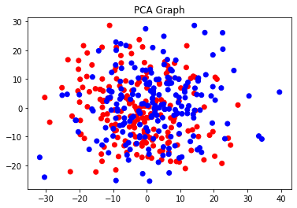
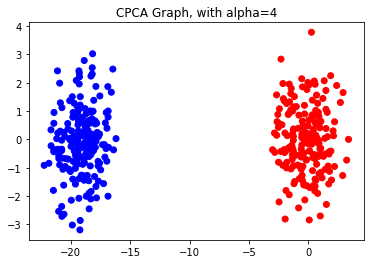

# Contrastive-PCA

This is an implementation of contrastive PCA in Python; that was described in [this paper](https://www.nature.com/articles/s41467-018-04608-8).

### What kind of dataset this would make sense to use this method on

- When we want to find the variations & trends within some specific variable(s) of the data. But top variations within that dataset (detected by normal PCA) are outside the context of the variable(s) of interest.

- For example: Suppose we have a dataset of gene-expression levels of a cancer patient, and we want to identify molecular subtypes of cancer.

- If we applied standard PCA, the top PC may correspond to the demographic variables for individuals (like their age, sex, ..) instead of the subtypes of cancer.

- So we can use a CPCA in that case. It uses a background dataset, which does not contain the patterns of interest.

- To conclude, if we have multiple datasets, and we're interested in discovering the sources of variation that are enriched in one dataset relative to the other, we can use contrastive PCA.

